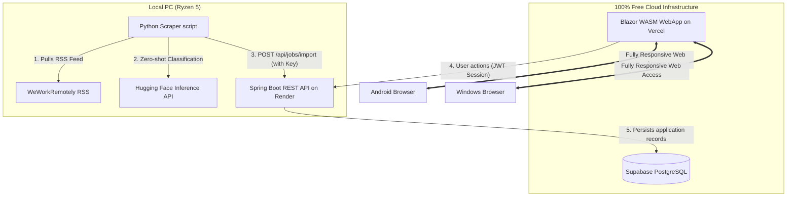

# MultiLang Job Tracker
### A Three-Language Ecosystem: Java 17 (Spring Boot) · C# (Blazor WASM) · Python 3 (BeautifulSoup + AI)

The **MultiLang Job Tracker** is a student portfolio project that demonstrates end-to-end full-stack integration across three distinct programming environments. Each module is built to exploit its language's native strengths:
1. **Frontend (C# / .NET)**: A responsive, glassmorphic client-side **Blazor WebAssembly** web application hosted on **Vercel** (runs on Android & Windows browsers anywhere).
2. **Backend (Java 17 / Spring Boot 3)**: A RESTful API engine securing requests with **JWT stateless authentication**, managing jobs and applications, hosted on **Render**.
3. **Scraper & AI (Python 3)**: A localized scraping script running on your PC (Ryzen 5) to bypass cloud IP blocks, pulling live jobs from **WeWorkRemotely RSS**, using the **Hugging Face Inference API** ( zero-shot classification) to extract top 5 required skills, and pushing them to the backend.
4. **Database (Supabase PostgreSQL)**: Fully persistent SQL cloud database.

---

## 📐 System Architecture & Data Flow



---

## 🛠️ Prerequisites

Before running the services, ensure you have the following installed locally:
- **Java JDK 17** (Adoptium Temurin or Amazon Corretto)
- **.NET SDK 8, 9, or 10**
- **Python 3.11+**
- **Hugging Face Inference API Token** (free to create)

---

## 🚀 Local Quickstart Guide (Development Mode)

For local development, the system runs out-of-the-box using **SQLite** as the database.

### Step 1: Start the Java Spring Boot Backend
1. Open a terminal in `java-backend/`.
2. Run the server:
   ```bash
   ..\maven_bin\apache-maven-3.9.6\bin\mvn.cmd spring-boot:run
   ```
3. The server will start on **port 8085** and create a local `jobtracker.db` SQLite file in the directory.

### Step 2: Configure and Run the Python Scraper
1. Open a terminal in `python-scraper/`.
2. Install dependencies:
   ```bash
   python -m pip install -r requirements.txt
   ```
3. Create a `.env` file based on `.env.example` and add your Hugging Face API key:
   ```env
   BACKEND_URL=http://localhost:8085
   SCRAPER_KEY=ScraperSuperSecretKey123
   HF_API_TOKEN=your_hugging_face_token_here
   ```
4. Run the scraper script (or double-click the `run_scraper.bat` file):
   ```bash
   python scraper.py --source weworkremotely --limit 20
   ```
   *Note: If the Hugging Face API is blocked or offline, the scraper gracefully falls back to a rule-based local keyword extractor.*

### Step 3: Run the C# Blazor WebAssembly Frontend
1. Open a terminal in `csharp-frontend/`.
2. Start the Blazor hosting server:
   ```bash
   dotnet run
   ```
3. Open your browser and navigate to **`http://localhost:5125`** to access the dashboard!

---

## ☁️ 100% Free Cloud Deployment Guide

To make the app accessible from anywhere (Windows & Android mobile devices) with session persistence, follow this deployment sequence:

### 1. Database Setup (Supabase)
1. Go to [Supabase](https://supabase.com/) and create a free account.
2. Create a new project.
3. Under **Project Settings -> Database**, find the connection parameters. Copy the connection string under the **URI** tab or write down:
   - Host, Database name, User, Password.
   - Example JDBC URL format: `jdbc:postgresql://<db-host-url>:5432/postgres?sslmode=require`

### 2. Backend Setup (Render)
1. Go to [Render](https://render.com/) and sign up for a free account.
2. Click **New +** and select **Web Service**. Connect your GitHub repository.
3. Configure the following build details:
   - **Language**: Docker (or Maven Java Web Service)
   - **Build Command**: `mvn clean package -DskipTests` (inside `java-backend/`)
   - **Start Command**: `java -jar target/backend-0.0.1-SNAPSHOT.jar`
4. Go to the **Environment** tab of your Render service and add these environment variables:
   - `SPRING_PROFILES_ACTIVE` = `prod`
   - `SPRING_DATASOURCE_URL` = `jdbc:postgresql://db.xxxx.supabase.co:5432/postgres?sslmode=require`
   - `SPRING_DATASOURCE_USERNAME` = `postgres`
   - `SPRING_DATASOURCE_PASSWORD` = `<your-supabase-db-password>`
   - `SCRAPER_KEY` = `ScraperSuperSecretKey123`
5. Click **Deploy**. Render will host your Java backend at a URL like `https://job-tracker-api.onrender.com`.

### 3. Frontend Setup (Vercel)
1. In `csharp-frontend/Services/JobTrackerService.cs`, update the remote base URL variable (`_apiBaseUrl`) to match your Render deployment URL (e.g. `https://job-tracker-api.onrender.com`).
2. Go to [Vercel](https://vercel.com/) and log in with your GitHub account.
3. Create a **New Project**, import the monorepo, and select `csharp-frontend` as the root directory.
4. Set the project preset to **Other** (since it is static WebAssembly files).
5. Build configuration:
   - **Build Command**: `dotnet publish -c Release -o dist`
   - **Output Directory**: `dist/wwwroot`
6. Click **Deploy**. Vercel will host your client WebApp for free. You can open it on your Android or Windows device!

---

## 🗓️ Automating the Scraper on Your Ryzen PC
To run the scraper on a daily schedule in the background of your Ryzen PC:
1. Open **Windows Task Scheduler** (search in Start menu).
2. Click **Create Basic Task**.
3. Set the trigger to **Daily** and choose a time (e.g., 8:00 AM).
4. Set the action to **Start a Program**.
5. Browse and select the [run_scraper.bat](file:///c:/thato's-jobtracker/python-scraper/run_scraper.bat) file.
6. Under **Start in (optional)**, paste the absolute path to your `python-scraper/` folder.
7. Click Finish. The task will now automate scraping, AI keyword parsing, and remote synchronization to your Render backend every day!
